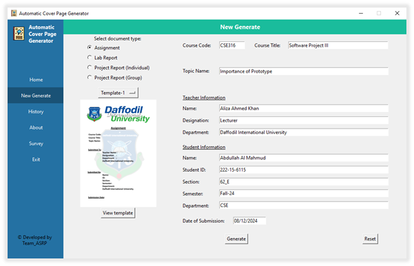
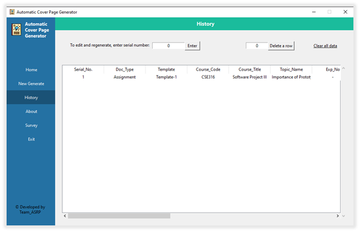

# Automatic-Cover-Page-Generator

## Background
Creating cover pages for academic documents is important but often tedious and error-prone. The "Automatic Cover Page Generator" automates this process, enhancing efficiency and professionalism by offering a user-friendly, customizable, and offline solution.

## Some Screenshots of this project 📸

## Objective
- Develop an application to automate cover page creation for academic documents.
- Ensure the application is user-friendly and accessible without internet access.
- Provide customization options for users to tailor cover page content and layout.
- Generate cover pages in PDF format for easy submission.

## Project Features and Interface

## Prototype design using figma:
https://www.figma.com/design/LXUDWxQl4PbPBbrSgdzbNl/Abdullah-Al-Mahmud's-team-library?node-id=0-1&t=uauzsayKX5XEGxkn-1

## List of Feature
- User-Friendly GUI: A graphical user interface developed using Tkinter to facilitate easy
input of necessary details.
- Data Validation: Ensures all user inputs are correctly formatted and complete before
processing.
- Data Persistence: Stores user inputs in an Excel sheet for future reference and reuse.
- PDF Generation: Creates professional PDF cover pages using the ReportLab library based
on user inputs.
- Data Reusability: Allows users to retrieve and reuse previously stored data to streamline
the cover page creation process.

## User Interfaces
- Main Input Form: A Tkinter-based form where users enter course details, teacher name,
student name, and submission date.
- Data Retrieval Form: An interface that allows users to select and reuse data from
previously stored inputs.
- Confirmation Dialogs: Pop-up dialogs to confirm data entry, validation success, and PDF
generation completion.

## Input Output Demo
- User Input:
  - Document Type & Template Selection: Users choose the document type and
template.
  - Course Details: Users input the course code and course name.
  - Teacher Info: Users provide the name, designation and department of the teacher.
  - Student Info: Users enter the student's details.
  - Submission Date: Users specify the submission date.
- Output: A PDF file is generated containing the provided details formatted into a cover
page.
